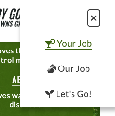

# Weedy Gonzales - Make lawns green again

## Diploma in Full Stack Software Development - Portfolio Project 1


Weedy Gonzales is a fictional lawn care and weed control company, operating in West Sussex, England. The site will target homeowners and tenants who are looking for lawn care services and advice.

The site's main objective is to guide the visitor towards getting in contact, using the shortest route possible - with ample opportunity to do so along the way.

The visitor's journey is laid out in a concise, lighthearted fashion, inspired by the ["Jobs To Be Done" framework](https://www.amazon.co.uk/Jobs-Be-Done-Playbook-Organization/dp/1933820683/ref=asc_df_1933820683/?tag=googshopuk-21&linkCode=df0&hvadid=427902758346&hvpos=&hvnetw=g&hvrand=470378916435561382&hvpone=&hvptwo=&hvqmt=&hvdev=c&hvdvcmdl=&hvlocint=&hvlocphy=1006628&hvtargid=pla-899714836217&psc=1&th=1&psc=1&tag=&ref=&adgrpid=103526071910&hvpone=&hvptwo=&hvadid=427902758346&hvpos=&hvnetw=g&hvrand=470378916435561382&hvqmt=&hvdev=c&hvdvcmdl=&hvlocint=&hvlocphy=1006628&hvtargid=pla-899714836217).

1. This journey starts by picturing the ideal outcome (Hero Image)
2. Reminding the visitor of the reasons they want a healthy lawn in the first place (Your Job)
3. How Weedy Gonzales can help them achieve the outcome (Our Job)
4. An opportunity to take action and get in contact (Let's Go)

Not all visitors might decide to take action only at the end of the journey, hence the Booking buttons in each section.


## [View the live website in github pages](https://phantompwr.github.io/pp1-weedy-gonzales/)
---

# Table of contents

- [UX](#ux)
    - [Website owner business goals](#website-owner-business-goals)
    - [Website visitor goals](#website-visitor-goals)
        - [New visitor goals](#new-visitor-goals)
        - [Returning visitor goals](#returning-visitor-goals)
    - [User stories](#user-stories)
    - [Site structure](#site-structure)
    - [Wireframes](#wireframes)
    - [Surface](#surface)
- [Features](#features)
- [Technology](#technology)
- [Testing](#testing)
    - [Functionality testing](#functionality-testing)
    - [Compatibility testing](#compatibility-testing)
    - [Code Validation](#code-validation)
    - [User stories testing](#user-stories-testing)
    - [Issues found during site development](#issues-found-during-site-development)
    - [Performance testing](#performance-testing)
- [Deployment](#deployment)
- [Credits](#credits)
- [Screenshots](#screenshots)


# UX

## Website owner business goals

The aim of this website is to make potential customers aware of the service and capture leads.

## Website visitor goals

### New visitor goals:
- find information about lawn care and weed control
- easily get in touch with the service provider to arrange a home visit

### Returning visitor goals:
- find up-to-date information and advice on lawn care and weed control
- arrange follow-up home visits

## User stories

### As a business owner:
* I want to introduce my services to potential customers
* I would like to encourage potential and existing customers to book home visits

### As a new customer:
* I wish to find information about lawn care and weed control
* I would like advice on my specific needs

### As a returning customer:
* I would like to find advice and tips on keeping my lawn healthy
* I would like to know how to keep my outdoor spaces clean and weed-free

## Site structure

The website is designed to guide the visitor towards getting in contact, using the shortest route possible - with ample opportunity to do so along the way. The aim is to give the visitor a pleasant experience, whether they use a desktop computer, tablet, mobile device or screen reader. There should also be feedback from the interface, including hover effects on links and buttons.

<br>

## Wireframes

The website wireframes were created using Balsamiq.
The tablet and phone wireframes show the different screens when scrolled.
<br>
### ***Desktop***
----


<br>

### ***Tablet***
----


<br>

### ***Phone***
----

<br>

## Surface

### Colours
Main colours used for the website:
* background: #3b6110
* body text (dark): #3a3a3a
* body text (light): #ffffff
* section heading (dark): #3b610f
* section heading (light): #ffffff
* hover colour: #3b610f
* button colour: #ffa41c

### Fonts
[see credits](#credits)
* body: Lato
* headings: Oswald
* fallback: sans-serif

### Images
[see credits](#credits)
* Photos: sourced from  [pexels.com](https://www.pexels.com/)
* Logo & favicon: Created myself


[Back to Table of contents](#table-of-contents)
___
# Features

The website consists of 1 main page containing 4 sections, and a 404 error page. The features of the site are as follows:

## Main Header
<br>

### ***Desktop/Landscape Header***
-----


<br>
* The header is fixed to the page top, for easy access to navigation
* On the left is the company logo, which also doubles as a "home" link
* On the right is the navigation bar
<br>

### ***Mobile Portrait Header***
-----


<br>
* Because the header is fixed at the top, it inevitably occupies valuable screen real estate. As a result, the navigation links will wrap on smaller-width devices/orientations. This in turn, would increase the height of the header and reduce the visible content even more
* Replacing the navigation links with a menu button(hamburger) means the height of the header can be kept to a minimum
<br>

## Navigation

* The navigation consists of links to the different page sections
* The appearance and behaviour of the navigation links, is consistent across devices
* The navigation links are:
    * Your Job - links to the introduction section
    * Our Job - links to the section containing the services on offer
    * Let's Go! - links to the contact form


<br>

### ***Desktop/Landscape Navigation***
-----


<br>
* Each navigation link has an icon, which matches the heading icon of the relevant section
* Link hover action is confirmed by adding a bottom border and changing the link colour
<br>
<br>

### ***Mobile Portrait Navigation***
-----


<br>
* The menu button(hamburger), activates a menu which slides in from the right of the screen
* Tapping on a link is, once again, confirmed by the appearance of a bottom border and a change in colour

<br>

## Hero Section
-----


<br>
<br>

### Hero Image
Below the header, is the hero section, containing:

* an image of a healthy, well-kept lawn
* clean, weed-free paving
* a pleasant, relaxing seating area - overlooking the garden

The image was specifically chosen to showcase the result of a healthy lawn, i.e. relaxing while enjoying your garden. Coupled with the company logo and motto/strapline at the top left, the perspective and angle of the image lead the visitor's eye towards the call to action on the right-hand side.

### Call to Action
* The call to action clearly states its purpose, what is on offer and a button encouraging the visitor to take action
* The "Book Now!" button opens the contact form in a modal pop-up, offering the visitor to give their contact details on the spot


-----

## Footer

* Footer is consistent on all pages. It has contact details on left side and social links on right side.
Each link will open in a separate tab in a browser.

## Home

* ### Portfolio section

    * Portfolio includes an image on the left side and profession information on the right side.
This section is consistent on all pages.

* ### Career path section

    * Career path section contains top achievements and career  points. It is presented as a timeline.

* ### Packages section

    * This part has three packages to choose for a customers. All buttons are linked to offer site.

## About me

* About me gives information about Annie's life and her professional background.

## Offer

* This site provide packages description to customers.
Here they can find more information and choose interesting offer.

## Contact

* Contact form is a main part on this site. User can contact by filling a form with interesting topic.
Below a form there is a map with location of a fitness studio.

##  Future implementations

### Technology
As this is purely an HTML & CSS project, my aim was to avoid JavaScript at all costs, in order to see how far I could take CSS.

After extensive research, I've come to the conclusion that the following implementations/improvements would require JavaScript:
* A floating back-to-top button, which appears after scrolling past a certain point
* Run a fading-out animation, when closing the modal window
* Stop the page from scrolling behind the open modal
* Prevent anchors adding unnecessary, meaningless browser history

### Content
* The ability to view availability and book a home visit
* A blog containing lawn care and weed control tips
* A page showing before & after photos, as well as customer feedback


[Back to Table of contents](#table-of-contents)
___
# Technologies used

### HTML5
* For page markup.

### CSS
* For visual presentation and interactive feedback.

### Font Awesome
* An icon library for navigation links, social links, page section visual cues and back-to-top button.

### Google fonts
* For serving custom fonts.

### GitHub
* Hosting the site repository.

### GitHub Pages
* Hosting the live site.

### Git
* For version control.

### Gitpod
* Online, cross-device IDE.

### Balsamiq
* Wireframing application.

### Affinity Designer
* Graphic editor for creating the site logo.

### Affinity Photo
* Photo editor for manipulating the hero & services images.

### Cloudconvert.com
* Converting images to .webp format

### Tinypng.com
* Image compression & optimisation


[Back to Table of contents](#table-of-contents)

___
# Testing

## Functionality testing 

 I used Mozilla web developer tools and Chrome developer tools throughout the project for testing and solving problems with responsiveness and style issues.
 
 [Unicorn Revealer](https://chrome.google.com/webstore/detail/unicorn-revealer/lmlkphhdlngaicolpmaakfmhplagoaln?hl=en-GB) extension to chrome browser was very helpful.


## Compatibility testing
 Site was tested across multiple virtual mobile devices and browsers. I checked all supported devices in both Mozilla web developer tolls and Chrome developer tools. 
 
 I tested on hardware devices such as: Lenovo ideapad with Ubuntu and Windows OS's, Lenovo smartphone with Android 7, Google pixel 3 with Android 11.


## User stories testing

### As a business owner:

- I would like to present myself and my offer on the website clearly to potential customers.
    > Name, photo of the instructor and top skills are on each page in portfolio section. Career path section at home page provides more details.

- I need to make sure that my current and new customers will find a professional help with their diets, personal or group trainings.
    > Customers can achieve this by contacting through contact form. They can choose interesting topic and describe their needs in a message box.

- I want my customers to be able to learn how to use my website intuitively and easily.
    > Each site has a fixed navigation menu and is accessible at all times. All content is presented with minimalistic approach.

- I would like to build and maintain relationship with potential and current customers.
    > Customers are able to find a links to social channels at the bottom of each page. Alternatively they can contact by email or contact form.


### As a new customer:
- wish to find information about personal trainer and check her/his qualifications.
    > User can see essential description on the home page. More information can be find in about page.

- I would like to contact with a diet coach to change my eating habits and start healthy lifestyle.
    > User can find a contact form in contact page. Alternatively can use an email. Email address if located in a footer the bottom of each page.

- I want to join in a fitness group with professional trainer, to find motivation and spend time actively.
    > Brief class description of fitness group classes can be find on the home page below career path section. Offer site provides more detailed description. Frome there user can click contact us button and send a message to the traier.

### As a returning customer:
- I need to contact my diet coach to reschedule my meeting.
    > User can find a contact form in contact page. Alternatively can use social channels or email.

- I would like to check timetable for current days and times for a group trainings.
    > Each site has time table at the bottom of the page.

- I want to show my friend a location of the fitness studio where we can join for a semi private personal training.
    > Each page contains location information in a footer. Users are able to find a location map in contact page.


---
## Issues found during site development

* #### Shortcut icon (favicon) didn't appear on deployed site


The shortcut icon displayed correctly, when viewing the site locally. However, the icon didn't appear on GitHub Pages.
* I placed the favicon.ico file in the root directory of the site, but nothing else

#####**Fix**
* I did a Google search for "favicon not displaying on github pages"
* Found an answer on StackOverflow (https://stackoverflow.com/questions/46163065/github-pages-website-favicon-not-showing)
* Added the below code snippet to the <head> of index.html and 404.html, which resolved the issue:
```
<link  rel="shortcut icon"  type="image/x-icon"  href="favicon.ico?">
```


* #### Ipad screen compatibility

I found a bugs on Ipad screens. I would like to keep years dates just above the stars, but they were shifted.


I had to create a block element with a class "ipad-screen" and non-breaking space element inside a block element.
In CSS file I had to create @media rule that will show this block element on Ipad displays only.

>}
@media screen and (max-width: 991px) and (min-width: 0px),(min-width:1200px){
    .ipad-screen {
    display: none;
}
}


## Performance testing

I run [Lighthouse](https://developers.google.com/web/tools/lighthouse/) tool to check performance of the website.
I had to do couple of changes to improve performance. Screenshots are presented below:


Final results:

I noticed that this tests scores vary from time to time and depends on external libraries as well. 


## Code Validation
 At the and of the project I used two websites to validate a code
 
 * [W3C CSS Validator](https://jigsaw.w3.org/css-validator/) to validate CSS
 * [Nu Html Checker](https://validator.w3.org/) to test HTML


[Back to Table of contents](#table-of-contents)

___
# Deployment

The project was deployed on GitHub Pages. I used Gitpod as a development environment where I commited all changes to git version control system.
I used push command in Gitpod to save changes into GitHub.

To deploy a project I had to:

* Log in to GitHub and click on repository to deploy ([MP1](https://github.com/marcin-kli/MP1))
* select `Settings` and find GitHub Pages section at the very bottom of the page
* from source select `none` and then `Milestone-Projects` branch.
* click `save` and page was deployed after auto-refresh.
>  Your site is published at https://marcin-kli.github.io/MP1/

To run localy:
* Log in to GitHub and click on repository to download ([MP1](https://github.com/marcin-kli/MP1))
* select `Code` and click Download the ZIP file.
* after download you can extract the file and use it in your local environment 

Alternatively you can [Clone](https://docs.github.com/en/free-pro-team@latest/github/creating-cloning-and-archiving-repositories/cloning-a-repository)
or [Fork](https://docs.github.com/en/free-pro-team@latest/github/getting-started-with-github/fork-a-repo)
this repository ([MP1](https://github.com/marcin-kli/MP1)) into your github account.

[Back to Table of contents](#table-of-contents)
___
# Credits


* To complete this project I used Code Institute's student template: [gitpod full template](https://github.com/Code-Institute-Org/gitpod-full-template)

* Ideas and knowledge library:

    * [w3schools.com](https://www.w3schools.com)

    * [css-tricks.com](https://css-tricks.com/)


### Code

* Font-size reset to multiples of 10: CSS Double Reset, thanks to [Eventyret_mentor](https://code-institute-room.slack.com/team/U4MVA9YQP) at Code Institute
* Links transition: [CSS transition Property](https://www.w3schools.com/cssref/css3_pr_transition.asp)
* Pure CSS modal, using the ":target pseudo-class" technique [CSS-only modal](https://www.w3schools.com/cssref/sel_target.asp)

#### README File
* [marcin-kli](https://github.com/marcin-kli) Whose [README.md](https://github.com/marcin-kli/MP1/blob/45f9748e8bccecbb3de182fbbabe521e4974064b/README.md) file I used as an example for creating mine.

### Content:
*  Content reference and inspiration:
[Greensleeves UK](https://www.greensleeves-uk.com/)
[Luxury Lawns UK](https://luxurylawns.co.uk/)

* **Copywriting:**
My VERY patient wife, Nikki, for her copywriting services

* **Website/company name**
  * I thought of the name after a throwaway comment from my wife, about a similarly-named cartoon mouse
  * I did a Google search for Weedy Gonzales, and came across an existing [Weedy Gonzales](https://soundcloud.com/pluegel), who appears to be a songwriter/DJ - so I doubt anybody would mistake him for a lawn care company.


### Images:

#### Pexels.com:
* [Pexels - Filipe Delgado](https://images.pexels.com/photos/1601495/pexels-photo-1601495.jpeg?cs=srgb&dl=pexels-filipe-delgado-1601495.jpg&fm=jpg)

* [Pexels - Kaboom Pics](https://images.pexels.com/photos/6083/garden-moss-stone-sett.jpg?cs=srgb&dl=pexels-kaboompics-com-6083.jpg&fm=jpg)

* [Pexels - Anastasiia Goncharova](https://images.pexels.com/photos/12515537/pexels-photo-12515537.jpeg?cs=srgb&dl=pexels-anastasiia-goncharova-12515537.jpg&fm=jpg)

* [Pexels - Max Artbovich](https://images.pexels.com/photos/7061662/pexels-photo-7061662.jpeg?cs=srgb&dl=pexels-max-vakhtbovych-7061662.jpg&fm=jpg)


[Back to Table of contents](#table-of-contents)
___

# Screenshots

## Project screenshots


[Back to Table of contents](#table-of-contents)
___
# Weedy Gonzales - Make lawns green again

## User-Centric Frontend Development Milestone Project.


Weedy Gonzales is a fictional lawn care and weed control company, operating in West Sussex, England. The site will target homeowners and tenants who are looking for lawn care services and advice.

The site's main objective is to guide the visitor towards getting in contact, using the shortest route possible - with ample opportunity to do so along the way.

The visitor's journey is laid out in a concise, lighthearted fashion, inspired by the ["Jobs To Be Done" framework](https://www.amazon.co.uk/Jobs-Be-Done-Playbook-Organization/dp/1933820683/ref=asc_df_1933820683/?tag=googshopuk-21&linkCode=df0&hvadid=427902758346&hvpos=&hvnetw=g&hvrand=470378916435561382&hvpone=&hvptwo=&hvqmt=&hvdev=c&hvdvcmdl=&hvlocint=&hvlocphy=1006628&hvtargid=pla-899714836217&psc=1&th=1&psc=1&tag=&ref=&adgrpid=103526071910&hvpone=&hvptwo=&hvadid=427902758346&hvpos=&hvnetw=g&hvrand=470378916435561382&hvqmt=&hvdev=c&hvdvcmdl=&hvlocint=&hvlocphy=1006628&hvtargid=pla-899714836217).

1. This journey starts by picturing the ideal outcome (Hero Image)
2. Reminding the visitor of the reasons they want a healthy lawn in the first place (Your Job)
3. How Weedy Gonzales can help them achieve the outcome (Our Job)
4. An opportunity to take action and get in contact (Let's Go)

Not all visitors might decide to take action only at the end of the journey, hence the Booking buttons in the Hero and Our Job sections.


## [View the live website in github pages](https://phantompwr.github.io/pp1-weedy-gonzales/)
---

# Table of contents

- [UX](#ux)
    - [Website owner business goals](#website-owner-business-goals)
    - [Website visitor goals](#website-visitor-goals)
        - [New visitor goals](#new-visitor-goals)
        - [Returning visitor goals](#returning-visitor-goals)
    - [User stories](#user-stories)
    - [Site structure](#site-structure)
    - [Wireframes](#wireframes)
    - [Surface](#surface)
- [Features](#features)
- [Technology](#technology)
- [Testing](#testing)
    - [Functionality testing](#functionality-testing)
    - [Compatibility testing](#compatibility-testing)
    - [Code Validation](#code-validation)
    - [User stories testing](#user-stories-testing)
    - [Issues found during site development](#issues-found-during-site-development)
    - [Performance testing](#performance-testing)
- [Deployment](#deployment)
- [Credits](#credits)
- [Screenshots](#screenshots)


# UX

## Website owner business goals

The aim of this website is to make potential customers aware of the service and capture leads.

## Website visitor goals

### New visitor goals:
- find information about lawn care and weed control
- easily get in touch with the service provider to arrange a home visit

### Returning visitor goals:
- find up-to-date information and advice on lawn care and weed control
- arrange follow-up home visits

## User stories

### As a business owner:
* I want to introduce my services to potential customers
* I would like to encourage potential and existing customers to book home visits

### As a new customer:
* I wish to find information about lawn care and weed control
* I would like advice on my specific needs

### As a returning customer:
* I would like to find advice and tips on keeping my lawn healthy
* I would like to know how to keep my outdoor spaces clean and weed-free

## Site structure

The website is designed to guide the visitor towards getting in contact, using the shortest route possible - with ample opportunity to do so along the way.

The aim is to give the visitor a pleasant experience, whether they use a desktop computer, tablet, mobile device or screen reader.

There should also be feedback from the interface, including hover effects on links and buttons.

## Wireframes

The website wireframes were created using Balsamiq.


## Surface

### Colours
Main colours used on the website:
* background: #3b6110
* body text (dark): #3a3a3a
* body text (light): #ffffff
* section heading (dark): #3b610f
* section heading (light): #ffffff
* hover colour: #3b610f
* button colour: #ffa41c

### Fonts 

* body: Lato
* headings: Oswald
* fallback: sans-serif

### Images

* Photos: sourced from [pexels.com](https://www.pexels.com/)
* Logo & favicon: Created myself


[Back to Table of contents](#table-of-contents)
___
# Features

The website consists of 1 main page containing 4 sections, and a 404 error page.


The website has the following features:

## Site Header

At the top of the page is the site header, which stays fixed when scrolling. It contains the company logo on the left and the navigation bar on the right.

## Navigation

* The company logo is also a "home" link for the site. 
* On desktop and landscape device screens, the navigation displays as links. Each link has an icon, which matches the heading icon of the corresponding section. On mobile devices - in portrait orientation - the navigation is hidden to save screen real estate. A burger icon reveals the navigation, sliding in from the right.
* Navigation scheme:

    * The navigation consists of either three page section links or the burger icon. The links are:
        * Your Job
        * Our Job
        * Let's Go!

## Timetable

* Each site has a timetable on the bottom. Customers can find classes times here.

## Footer

* The footer contains the following elements:
	* Social media links: each link opens in a new browser tab

## Home

* ### Portfolio section

    * Portfolio includes an image on the left side and profession information on the right side.
This section is consistent on all pages.

* ### Career path section

    * Career path section contains top achievements and career  points. It is presented as a timeline.

* ### Packages section

    * This part has three packages to choose for a customers. All buttons are linked to offer site.

## About me

* About me gives information about Annie's life and her professional background.

## Offer

* This site provide packages description to customers.
Here they can find more information and choose interesting offer.

## Contact

* Contact form is a main part on this site. User can contact by filling a form with interesting topic.
Below a form there is a map with location of a fitness studio.

##  Future implementations

### Technology
As this is purely an HTML & CSS project, my aim was to avoid JavaScript at all costs, in order to see how far I could take CSS.

After extensive research, I've come to the conclusion that the following implementations/improvements would require JavaScript:
* A floating back-to-top button, which appears after scrolling past a certain point
* Run a fading-out animation, when closing the modal window
* Stop the page from scrolling behind the open modal
* Prevent anchors adding unnecessary, meaningless browser history

### Content
* The ability to view availability and book a home visit
* A blog containing lawn care and weed control tips
* A page showing before & after photos, as well as customer feedback


[Back to Table of contents](#table-of-contents)
___
# Technologies used

### HTML5
* For page markup.

### CSS
* For visual presentation and interactive feedback.

### Font Awesome
* An icon library for navigation links, social links, page section visual cues and back-to-top button.

### Google fonts
* For serving custom fonts.

### GitHub
* Hosting the site repository.

### GitHub Pages
* Hosting the live site.

### Git
* For version control.

### Gitpod
* Online, cross-device IDE.

### Balsamiq
* Wireframing application.

### Affinity Designer
* Graphic editor for creating the site logo.

### Affinity Photo
* Photo editor for manipulating the hero & services images.

### Cloudconvert.com
* Converting images to .webp format

### Tinypng.com
* Image compression & optimisation


[Back to Table of contents](#table-of-contents)

___
# Testing

## Functionality testing 

 I used Mozilla web developer tools and Chrome developer tools throughout the project for testing and solving problems with responsiveness and style issues.
 
 [Unicorn Revealer](https://chrome.google.com/webstore/detail/unicorn-revealer/lmlkphhdlngaicolpmaakfmhplagoaln?hl=en-GB) extension to chrome browser was very helpful.


## Compatibility testing
 Site was tested across multiple virtual mobile devices and browsers. I checked all supported devices in both Mozilla web developer tolls and Chrome developer tools. 
 
 I tested on hardware devices such as: Lenovo ideapad with Ubuntu and Windows OS's, Lenovo smartphone with Android 7, Google pixel 3 with Android 11.


## User stories testing

### As a business owner:

- I would like to present myself and my offer on the website clearly to potential customers.
    > Name, photo of the instructor and top skills are on each page in portfolio section. Career path section at home page provides more details.

- I need to make sure that my current and new customers will find a professional help with their diets, personal or group trainings.
    > Customers can achieve this by contacting through contact form. They can choose interesting topic and describe their needs in a message box.

- I want my customers to be able to learn how to use my website intuitively and easily.
    > Each site has a fixed navigation menu and is accessible at all times. All content is presented with minimalistic approach.

- I would like to build and maintain relationship with potential and current customers.
    > Customers are able to find a links to social channels at the bottom of each page. Alternatively they can contact by email or contact form.


### As a new customer:
- wish to find information about personal trainer and check her/his qualifications.
    > User can see essential description on the home page. More information can be find in about page.

- I would like to contact with a diet coach to change my eating habits and start healthy lifestyle.
    > User can find a contact form in contact page. Alternatively can use an email. Email address if located in a footer the bottom of each page.

- I want to join in a fitness group with professional trainer, to find motivation and spend time actively.
    > Brief class description of fitness group classes can be find on the home page below career path section. Offer site provides more detailed description. Frome there user can click contact us button and send a message to the traier.

### As a returning customer:
- I need to contact my diet coach to reschedule my meeting.
    > User can find a contact form in contact page. Alternatively can use social channels or email.

- I would like to check timetable for current days and times for a group trainings.
    > Each site has time table at the bottom of the page.

- I want to show my friend a location of the fitness studio where we can join for a semi private personal training.
    > Each page contains location information in a footer. Users are able to find a location map in contact page.


---
## Issues found during site development

* #### Shortcut icon (favicon) didn't appear on deployed site


The shortcut icon displayed correctly, when viewing the site locally. However, the icon didn't appear on GitHub Pages.
* I placed the favicon.ico file in the root directory of the site, but nothing else

#####**Fix**
* I did a Google search for "favicon not displaying on github pages"
* Found an answer on StackOverflow (https://stackoverflow.com/questions/46163065/github-pages-website-favicon-not-showing)
* Added the below code snippet to the <head> of index.html and 404.html, which resolved the issue:
```
<link  rel="shortcut icon"  type="image/x-icon"  href="favicon.ico?">
```


* #### Ipad screen compatibility

I found a bugs on Ipad screens. I would like to keep years dates just above the stars, but they were shifted.


I had to create a block element with a class "ipad-screen" and non-breaking space element inside a block element.
In CSS file I had to create @media rule that will show this block element on Ipad displays only.

>}
@media screen and (max-width: 991px) and (min-width: 0px),(min-width:1200px){
    .ipad-screen {
    display: none;
}
}


## Performance testing

I run [Lighthouse](https://developers.google.com/web/tools/lighthouse/) tool to check performance of the website.
I had to do couple of changes to improve performance. Screenshots are presented below:


Final results:

I noticed that this tests scores vary from time to time and depends on external libraries as well. 


## Code Validation
 At the and of the project I used two websites to validate a code
 
 * [W3C CSS Validator](https://jigsaw.w3.org/css-validator/) to validate CSS
 * [Nu Html Checker](https://validator.w3.org/) to test HTML


[Back to Table of contents](#table-of-contents)

___
# Deployment

The project was deployed on GitHub Pages. I used Gitpod as a development environment where I commited all changes to git version control system.
I used push command in Gitpod to save changes into GitHub.

To deploy a project I had to:

* Log in to GitHub and click on repository to deploy ([MP1](https://github.com/marcin-kli/MP1))
* select `Settings` and find GitHub Pages section at the very bottom of the page
* from source select `none` and then `Milestone-Projects` branch.
* click `save` and page was deployed after auto-refresh.
>  Your site is published at https://marcin-kli.github.io/MP1/

To run locally:
* Log in to GitHub and click on repository to download ([MP1](https://github.com/marcin-kli/MP1))
* select `Code` and click Download the ZIP file.
* after download you can extract the file and use it in your local environment 

Alternatively you can [Clone](https://docs.github.com/en/free-pro-team@latest/github/creating-cloning-and-archiving-repositories/cloning-a-repository)
or [Fork](https://docs.github.com/en/free-pro-team@latest/github/getting-started-with-github/fork-a-repo)
this repository ([MP1](https://github.com/marcin-kli/MP1)) into your github account.

[Back to Table of contents](#table-of-contents)
___
# Credits


* To complete this project I used Code Institute's student template: [gitpod full template](https://github.com/Code-Institute-Org/gitpod-full-template)

* Ideas and knowledge library:

    * [w3schools.com](https://www.w3schools.com)

    * [css-tricks.com](https://css-tricks.com/)


### Code

* Font-size reset to multiples of 10: CSS Double Reset, thanks to [Eventyret_mentor](https://code-institute-room.slack.com/team/U4MVA9YQP) at Code Institute
* Links transition: [CSS transition Property](https://www.w3schools.com/cssref/css3_pr_transition.asp)
* Pure CSS modal, using the ":target pseudo-class" technique [CSS-only modal](https://www.w3schools.com/cssref/sel_target.asp)

#### README File
* [marcin-kli](https://github.com/marcin-kli) Whose [README.md](https://github.com/marcin-kli/MP1/blob/45f9748e8bccecbb3de182fbbabe521e4974064b/README.md) file I used as an example for creating mine.

### Content:
*  Content reference and inspiration:
[Greensleeves UK](https://www.greensleeves-uk.com/)
[Luxury Lawns UK](https://luxurylawns.co.uk/)

* **Copywriting:**
My VERY patient wife, Nikki, for her copywriting services

* **Website/company name**
  * I thought of the name after a throwaway comment from my wife, about a similarly-named cartoon mouse
  * I did a Google search for Weedy Gonzales, and came across an existing [Weedy Gonzales](https://soundcloud.com/pluegel), who appears to be a songwriter/DJ - so I doubt anybody would mistake him for a lawn care company.


### Images:

#### Pexels.com:
* [Pexels - Filipe Delgado](https://images.pexels.com/photos/1601495/pexels-photo-1601495.jpeg?cs=srgb&dl=pexels-filipe-delgado-1601495.jpg&fm=jpg)

* [Pexels - Kaboom Pics](https://images.pexels.com/photos/6083/garden-moss-stone-sett.jpg?cs=srgb&dl=pexels-kaboompics-com-6083.jpg&fm=jpg)

* [Pexels - Anastasiia Goncharova](https://images.pexels.com/photos/12515537/pexels-photo-12515537.jpeg?cs=srgb&dl=pexels-anastasiia-goncharova-12515537.jpg&fm=jpg)

* [Pexels - Max Artbovich](https://images.pexels.com/photos/7061662/pexels-photo-7061662.jpeg?cs=srgb&dl=pexels-max-vakhtbovych-7061662.jpg&fm=jpg)


[Back to Table of contents](#table-of-contents)
___

# Screenshots


## Project screenshots


[Back to Table of contents](#table-of-contents)
___