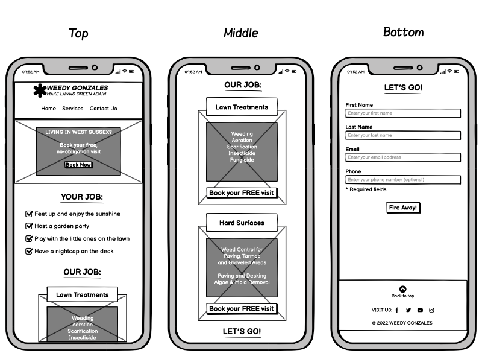

# Weedy Gonzales - Make lawns green again

## Diploma in Full Stack Software Development - Portfolio Project 1


Weedy Gonzales is a fictional lawn care and weed control company, operating in West Sussex, England. The site will target homeowners and tenants who are looking for lawn care services and advice.

The site's main objective is to guide the visitor towards getting in contact, using the shortest route possible - with ample opportunity to do so along the way.

The visitor's journey is laid out in a concise, lighthearted fashion, inspired by the ["Jobs To Be Done" framework](https://www.amazon.co.uk/Jobs-Be-Done-Playbook-Organization/dp/1933820683/ref=asc_df_1933820683/?tag=googshopuk-21&linkCode=df0&hvadid=427902758346&hvpos=&hvnetw=g&hvrand=470378916435561382&hvpone=&hvptwo=&hvqmt=&hvdev=c&hvdvcmdl=&hvlocint=&hvlocphy=1006628&hvtargid=pla-899714836217&psc=1&th=1&psc=1&tag=&ref=&adgrpid=103526071910&hvpone=&hvptwo=&hvadid=427902758346&hvpos=&hvnetw=g&hvrand=470378916435561382&hvqmt=&hvdev=c&hvdvcmdl=&hvlocint=&hvlocphy=1006628&hvtargid=pla-899714836217).

1. This journey starts by picturing the ideal outcome (Hero Image)
2. Reminding the visitor of the reasons they want a healthy lawn in the first place (Your Job)
3. How Weedy Gonzales can help them achieve the outcome (Our Job)
4. An opportunity to take action and get in contact (Let's Go)

Not all visitors might decide to take action only at the end of the journey, hence the Booking buttons in each section.

<br>

---
## [View the live website in github pages](https://phantompwr.github.io/pp1-weedy-gonzales/)
---

<br>

# Table of contents

- [UX](#ux)
    - [Website owner business goals](#website-owner-business-goals)
    - [Website visitor goals](#website-visitor-goals)
        - [New visitor goals](#new-visitor-goals)
        - [Returning visitor goals](#returning-visitor-goals)
    - [User stories](#user-stories)
    - [Site structure](#site-structure)
    - [Wireframes](#wireframes)
    - [Surface](#surface)
- [Features](#features)
- [Technology](#technology)
- [Testing](#testing)
    - [Functionality testing](#functionality-testing)
    - [Compatibility testing](#compatibility-testing)
    - [Code Validation](#code-validation)
    - [User stories testing](#user-stories-testing)
    - [Issues found during site development](#issues-found-during-site-development)
    - [Performance testing](#performance-testing)
- [Deployment](#deployment)
- [Credits](#credits)
- [Screenshots](#screenshots)


# UX

## Website owner business goals

The aim of this website is to make potential customers aware of the service and capture leads.

## Website visitor goals

### New visitor goals:
- find information about lawn care and weed control
- easily get in touch with the service provider to arrange a home visit

### Returning visitor goals:
- find up-to-date information and advice on lawn care and weed control
- arrange follow-up home visits

<br>

## User stories
---

### As a business owner:
* I want to introduce my services to potential customers
* I would like to encourage potential and existing customers to book home visits

### As a new customer:
* I wish to find information about lawn care and weed control
* I would like advice on my specific needs

### As a returning customer:
* I would like to find advice and tips on keeping my lawn healthy
* I would like to know how to keep my outdoor spaces clean and weed-free

## Site structure
---

The website is designed to guide the visitor towards getting in contact, using the shortest route possible - with ample opportunity to do so along the way. The aim is to give the visitor a pleasant experience, whether they use a desktop computer, tablet, mobile device or screen reader. There should also be feedback from the interface, including hover effects on links and buttons.

<br>

## Wireframes
---

The website wireframes were created using Balsamiq.
The tablet and phone wireframes show the different screens when scrolled.

<br>

### ***Desktop***
----


<br>

### ***Tablet***
----


<br>

### ***Phone***
----


<br>

## Surface
---

### Colours
Main colours used for the website:
* background: #3b6110
* body text (dark): #3a3a3a
* body text (light): #ffffff
* section heading (dark): #3b610f
* section heading (light): #ffffff
* hover colour: #3b610f
* button colour: #ffa41c

### Fonts
[see credits](#credits)
* body: Lato
* headings: Oswald
* fallback: sans-serif

### Images
[see credits](#credits)
* Photos: sourced from  [pexels.com](https://www.pexels.com/)
* Logo & favicon: Created myself


[Back to Table of contents](#table-of-contents)
___

<br>
<br>

# Features


The website consists of 1 main page containing 4 sections, and a 404 error page. The features of the site are as follows:

## Main Header

<br>

### ***Desktop/Landscape Header***
----


<br>

* The header is fixed to the page top, for easy access to navigation
* On the left is the company logo, which also doubles as a "home" link
* On the right is the navigation bar

<br>

### ***Mobile Portrait Header***
----


<br>

* Because the header is fixed at the top, it inevitably occupies valuable screen real estate. As a result, the navigation links will wrap on smaller-width devices/orientations. This in turn, would increase the height of the header and reduce the visible content even more
* Replacing the navigation links with a menu button(hamburger) means the height of the header can be kept to a minimum

<br>

## Navigation

* Navigation consists of links to the different page sections
* Navigation link appearance and behaviour is consistent across devices
* The links are:
    * Your Job - scrolls to the introduction/benefits section
    * Our Job - scrolls to the section containing the services on offer
    * Let's Go! - scrolls to the contact form


<br>
<br>

### ***Desktop/Landscape Navigation***
----


<br>

* Each navigation link has an icon, which matches the heading icon of the relevant section
* Link hover action is confirmed by adding a bottom border and changing the link colour

<br>
<br>

### ***Mobile Portrait Navigation***
----


<br>

* The menu button(hamburger), activates a menu which slides in from the right of the screen
* Tapping on a link is, once again, confirmed by the appearance of a bottom border and a change in colour

<br>

## Hero Section
----


<br>
<br>

### Hero Image
Below the header, is the hero section, containing:

* an image of a healthy, well-kept lawn
* clean, weed-free paving
* a pleasant, relaxing seating area - overlooking the garden

The image was specifically chosen to showcase the result of a healthy lawn, i.e. relaxing while enjoying your garden. Coupled with the company logo and motto/strapline at the top left, the perspective and angle of the image lead the visitor's eye towards the call to action on the right-hand side.

### Call to Action
* The call to action clearly states its purpose, what is on offer and a button encouraging the visitor to take action
* The "Book Now!" button opens the contact form in a modal window, offering the visitor the opportunity to provide their contact details on the spot

<br>
<br>

## Modal Window


In order to encourage the visitor to provide contact details, the site also features a modal window, containing a contact form.
* The modal window is unobtrusive and initiated by the visitor
* A semi-opaque background gives a visual clue that the visitor is still on the the same page, yet focuses attention on the call-to-action and contact form
* An introductory paragraph reminds the visitor of the modal window's purpose and encourages them to fill in the form


<br>

----


## Footer


* Contains links to the company's various social media pages
* A back-to-top button provides a shortcut to the top of the page, without having to manually scroll multiple times. This is especially helpful on smaller screens
* The final element in the footer is the copyright notice

<br>

### ***Social Media Links***
----


* Familiar, easily identifiable icons, link to each corresponding social platform
* Both `title` and `aria-label` attributes remind the visitor where the icon links to, as well as informing them that the link opens in a new browser tab
* A border and change of colour give visual feedback when interacting with the links
* *PLEASE NOTE:* As this is a fictitious company website, all social media links go to the main URLs of the respective platforms - NOT real Weedy Gonzales accounts 

<br>

### ***Back to Top Button***
----


* The back-to-top button contains both text and an icon, which makes its purpose clear
* Once again, visual feedback confirms purpose and interaction

<br>

### ***Mobile Footer***
----


* On small mobile screens, the order of the elements changes so the back-to-top button is above all other footer elements. This makes it easier to access
* In line with the "design for big thumbs" principle, social media icons have sufficient space to avoid touching unintended links

<br>


## Content Sections
____

<br>


### Your Job (Benefits)
----


* This section reaffirms the ideal scenario pictured by the hero image, i.e. the visitor has better things to do than slaving away over weeds
* The title - Your Job - breaks away from the hard-sell "benefits" approach, which is almost the norm in many industries. Instead, it puts the visitor first
* The visitor is presented with a checklist, which deliberately doesn't include maintaining the lawn, paving, etc.
* A prominent, yet friendly button invites the visitor to take action

<br>

### Our Job (Services)
----


* In a similar vein to the previous section, the message is simple: lawn treatment & weed control isn't the job of the visitor
* This is why the section is titled "Our Job"; the time, equipment and experience involved is not something the visitor wants to be trammeled by
* Once again, the visitor is offered the opportunity to unload the burden of maintaining their lawns and/or hard surfaces

<br>

### Let's Go! (Contact)
----


* The heading, paragraph and form button all urge the visitor to take action - again, without using the usual pushy sales language

<br>

### 404 Page
----


* The light-hearted language is used to defuse a potentially frustrating situation
* The button text reassures the visitor that it has come to the rescue
____

<br>
<br>


#  Future Implementations

### Technology
As this is purely an HTML & CSS project, my aim was to avoid JavaScript at all costs, and see how far I could take CSS.

After extensive research, I've come to the conclusion that the following implementations/improvements would require JavaScript:
* A floating back-to-top button, appearing after scrolling past a certain point
* Running a fading-out animation, when closing the modal window
* Stop the page from scrolling behind the open modal
* Prevent anchors adding unnecessary, meaningless browser history

### Content
* A calendar booking system to view availability and book a home visit
* A blog containing lawn care and weed control tips
* A live chat function for handling enquiries and offering advice
* A page showing before & after photos, as well as customer feedback


[Back to Table of contents](#table-of-contents)
___

<br>
<br>

# Technologies Used

### HTML5
* For page markup.

### CSS
* For visual presentation and interactive feedback.

### Font Awesome
* An icon library for navigation links, social links, page section visual cues and back-to-top button.

### Google fonts
* For serving custom fonts.

### GitHub
* Hosting the site repository.

### GitHub Pages
* Hosting the live site.

### Git
* For version control.

### Gitpod
* Online, cross-device IDE.

### Balsamiq
* Wireframing application.

### Affinity Designer
* Graphic editor for creating the site logo.

### Affinity Photo
* Photo editor for manipulating the hero & services images.

### Cloudconvert.com
* Converting images to .webp format

### Tinypng.com
* Image compression & optimisation


[Back to Table of contents](#table-of-contents)

___
# Testing

<br>

## Functionality testing
---

 I mainly used Chrome developer tools throughout the project for testing and troubleshooting.
 
  The Chrome browser extention, [Unicorn Revealer](https://chrome.google.com/webstore/detail/unicorn-revealer/lmlkphhdlngaicolpmaakfmhplagoaln?hl=en-GB) was very helpful in identifying elements overflowing their containers.


## Compatibility testing
---

 Testing was done on various browsers, virtual and physical devices.

<br>

 ### Desktop Browsers
| Browser | Device | Operating System |
|--|--|--|
| Google Chrome (v103.0.5060.134) | iMac 27 inch | MacOS Big Sur (v11.6.7) |
| Mozilla FireFox (v103.0.1) | iMac 27 inch | MacOS Big Sur (v11.6.7) |
| Apple Safari (v15.6) | iMac 27 inch | MacOS Big Sur (v11.6.7) |
| Microsoft Edge (v103.0.1264.77) | iMac 27 inch | MacOS Big Sur (v11.6.7) |

<br>

 ### Laptop Browsers
| Browser | Device | Operating System |
|--|--|--|
| Google Chrome (v103.0.5060.134) | Macbook Pro 13 inch | MacOS Big Sur (v11.6.1) |
| Mozilla FireFox (v103.0.1) | Macbook Pro 13 inch | MacOS Big Sur (v11.6.1) |
| Apple Safari (v15.6) | Macbook Pro 13 inch | MacOS Big Sur (v11.6.1) |
| Microsoft Edge (v103.0.1264.77) | Macbook Pro 13 inch | MacOS Big Sur (v11.6.1) |

<br>

### Mobile Devices
| Browser | Device | Operating System |
|--|--|--|
| Safari (v15) | iPhone Xs | iOS (v15.6) |
| Safari (v15) | iPhone 12 Pro | iOS (v15.5) |

<br>

### Virtual Devices

The following virtual devices were tested in Chrome Developer Tools:

<br>

**Phones**

 * iPhone 5/SE
 * iPhone X
 * iPhone SE
 * iPhone XR
 * Google Pixel 5
 * Samsung Galaxy S8+
 * Samsung Galaxy S20 Ultra

<br>

**Tablets**

* iPad Mini
* iPad Air
* iPad Pro
* Surface Pro 7

<br>

**Other**

* Google Nest Hub
* Google Nest Hub Max


## User stories testing
---

### As a business owner:

- I want to introduce my services to potential customers
    > An overview of available services is presented in the "Our Job" section

- I would like to encourage potential and existing customers to book home visits
    > In addition to the contact form in the "Let's Go" section, buttons to access the modal contact form are present in every section of the page


### As a new customer:
- I wish to find information about lawn care and weed control
    > Once again, essential information is available in the "Our Job" section, along with an invitation to get in touch

- I would like advice on my specific needs
    > As a minimum viable product, the website offers this opportunity via a response to providing contact details


### As a returning customer:
- I would like to find advice and tips on keeping my lawn healthy
- I would like to know how to keep my outdoor spaces clean and weed-free
    > In this first version of the website, all enquiries are handled by the contact form.
    >  Future iterations will include blog articles containing hints & tips, and a live chat function for handling questions and enquiries


---
## Issues found during site development

* #### Shortcut icon (favicon) didn't appear on the deployed site


The shortcut icon displayed correctly, when viewing the site locally. However, the icon didn't appear on GitHub Pages.
* I placed the favicon.ico file in the root directory of the site, but nothing else

### **Fix**
* I did a Google search for "favicon not displaying on github pages"
* Found an answer on StackOverflow (https://stackoverflow.com/questions/46163065/github-pages-website-favicon-not-showing)
* Added the below code snippet to the <head> of index.html and 404.html, which resolved the issue:
```
<link  rel="shortcut icon"  type="image/x-icon"  href="favicon.ico?">
```


* #### Macbook Pro Compatibility

The layout of the call-to-action inside the hero section, broke on the 2020 13inch Macbook Pro.


I had to create a block element with a class "ipad-screen" and non-breaking space element inside a block element.
In CSS file I had to create @media rule that will show this block element on Ipad displays only.

>}
@media screen and (max-width: 991px) and (min-width: 0px),(min-width:1200px){
    .ipad-screen {
    display: none;
}
}


## *** === REPLACE === *** Performance testing

I run [Lighthouse](https://developers.google.com/web/tools/lighthouse/) tool to check performance of the website.
I had to do couple of changes to improve performance. Screenshots are presented below:


Final results:

I noticed that this tests scores vary from time to time and depends on external libraries as well. 


## *** === REPLACE === *** Code Validation
---
 At the and of the project I used two websites to validate a code
 
 * [W3C CSS Validator](https://jigsaw.w3.org/css-validator/) to validate CSS
 * [Nu Html Checker](https://validator.w3.org/) to test HTML


[Back to Table of contents](#table-of-contents)

___
# *** === REPLACE === *** Deployment

The project was deployed on GitHub Pages. I used Gitpod as a development environment where I commited all changes to git version control system.
I used push command in Gitpod to save changes into GitHub.

To deploy a project I had to:

* Log in to GitHub and click on repository to deploy ([MP1](https://github.com/marcin-kli/MP1))
* select `Settings` and find GitHub Pages section at the very bottom of the page
* from source select `none` and then `Milestone-Projects` branch.
* click `save` and page was deployed after auto-refresh.
>  Your site is published at https://marcin-kli.github.io/MP1/

To run localy:
* Log in to GitHub and click on repository to download ([MP1](https://github.com/marcin-kli/MP1))
* select `Code` and click Download the ZIP file.
* after download you can extract the file and use it in your local environment 

Alternatively you can [Clone](https://docs.github.com/en/free-pro-team@latest/github/creating-cloning-and-archiving-repositories/cloning-a-repository)
or [Fork](https://docs.github.com/en/free-pro-team@latest/github/getting-started-with-github/fork-a-repo)
this repository ([MP1](https://github.com/marcin-kli/MP1)) into your github account.

[Back to Table of contents](#table-of-contents)
___
# Credits


* To complete this project I used Code Institute's student template: [gitpod full template](https://github.com/Code-Institute-Org/gitpod-full-template)

* Ideas and knowledge library:

    * [w3schools.com](https://www.w3schools.com)

    * [css-tricks.com](https://css-tricks.com/)


### Code

* Font-size reset to multiples of 10: CSS Double Reset, thanks to [Eventyret_mentor](https://code-institute-room.slack.com/team/U4MVA9YQP) at Code Institute
* Links transition: [CSS transition Property](https://www.w3schools.com/cssref/css3_pr_transition.asp)
* Pure CSS modal, using the ":target pseudo-class" technique [CSS-only modal](https://www.w3schools.com/cssref/sel_target.asp)

#### README File
* [marcin-kli](https://github.com/marcin-kli) Whose [README.md](https://github.com/marcin-kli/MP1/blob/45f9748e8bccecbb3de182fbbabe521e4974064b/README.md) file I used as an example for creating mine.

### Content:
*  Content reference and inspiration:
[Greensleeves UK](https://www.greensleeves-uk.com/)
[Luxury Lawns UK](https://luxurylawns.co.uk/)

* **Copywriting:**
My VERY patient wife, Nikki, for her copywriting services

* **Website/company name**
  * I thought of the name after a throwaway comment from my wife, about a similarly-named cartoon mouse
  * I did a Google search for Weedy Gonzales, and came across an existing [Weedy Gonzales](https://soundcloud.com/pluegel), who appears to be a songwriter/DJ - so I doubt anybody would mistake him for a lawn care company.


### Images:

#### Pexels.com:
* [Pexels - Filipe Delgado](https://images.pexels.com/photos/1601495/pexels-photo-1601495.jpeg?cs=srgb&dl=pexels-filipe-delgado-1601495.jpg&fm=jpg)

* [Pexels - Kaboom Pics](https://images.pexels.com/photos/6083/garden-moss-stone-sett.jpg?cs=srgb&dl=pexels-kaboompics-com-6083.jpg&fm=jpg)

* [Pexels - Anastasiia Goncharova](https://images.pexels.com/photos/12515537/pexels-photo-12515537.jpeg?cs=srgb&dl=pexels-anastasiia-goncharova-12515537.jpg&fm=jpg)

* [Pexels - Max Artbovich](https://images.pexels.com/photos/7061662/pexels-photo-7061662.jpeg?cs=srgb&dl=pexels-max-vakhtbovych-7061662.jpg&fm=jpg)


[Back to Table of contents](#table-of-contents)
___

# Screenshots

## *** === REPLACE === *** Project screenshots


[Back to Table of contents](#table-of-contents)
___